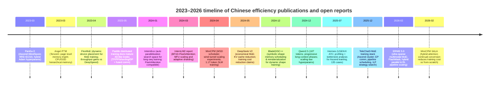

# Computationally Efficient Training Methods Used by Chinese AI Labs for LLMs and Neural Networks from 2023 to 2026

## Executive summary

Between 2023 and March 12, 2026, Chinese AI labs and companies converged on a “full‑stack efficiency” playbook for training large language models (LLMs) and other neural networks: (a) **sparse or conditional computation** (Mixture‑of‑Experts, activation sparsity) to reduce *active* FLOPs per token; (b) **precision and numerical engineering** (BF16 everywhere, and increasingly FP8 for training) to raise throughput at acceptable stability; (c) **hybrid parallelism + optimizer/parameter sharding** (ZeRO‑like) to fit models and long contexts by trading communication for memory; (d) **memory‑efficient attention and long‑context strategies** (FlashAttention compatibility, long‑sequence parallelization, progressive context extension, masked/sparse attention and scheduling); and (e) **operator/compiler/hardware‑aware optimizations**, increasingly shaped by domestic accelerators (notably **Ascend** NPUs), including profiling/diagnosis systems, fusion, recomputation, and stability verification. citeturn12view2turn31view0turn36view0turn37view0turn29view0

Primary sources from Chinese organizations show several recurring, concrete patterns:

Chinese open technical reports frequently disclose **global token counts**, **throughput metrics** (tokens/sec, TFLOPS, MFU), and **training‑system design** even when they do *not* disclose absolute GPU‑hour budgets. For example, **Baichuan 2** reports scalable training on **1,024 NVIDIA A800 GPUs** and system‑level efficiency **exceeding 180 TFLOPS**, alongside specific optimizer and stability tweaks (AdamW β’s, warmup, cosine decay, BF16, auxiliary max‑z loss). citeturn11view0turn39view0

For large‑scale long‑sequence training, **InternEvo** (Shanghai AI Lab / InternLM ecosystem) publishes scaling results including **tokens/GPU/second**, TFLOPS, and MFU at thousand‑GPU scale, with explicit configuration knobs (e.g., ZeRO‑1 scope, BF16, activation checkpointing). These reports emphasize communication‑aware sharding and FlashAttention compatibility as non‑negotiable for practical throughput. citeturn12view1turn12view2turn12view0

On domestic hardware, **Huawei’s PanGu‑Σ** (trained on Ascend 910 with MindSpore) demonstrates an efficiency‑driven *sparse heterogeneous computing* approach: a Random Routed Experts (RRE) design plus “Expert Computation and Storage Separation (ECSS)” yields a reported **69,905 tokens/s** observed throughput on **512 Ascend 910 accelerators** and a **6.3×** throughput improvement versus an MoE baseline (same hyperparameters) while training on **329B tokens**; it also discloses optimizer hyperparameters (β1/β2/ε’s, warmup/decay steps, end LR) and an inheritance strategy starting from PanGu‑α 13B to accelerate convergence. citeturn31view0

By 2025–2026, Chinese industrial labs increasingly describe **ultra‑sparse MoE** (very low activation rates) combined with **FP8 training**, hierarchical load‑balancing, and pipeline scheduling. The open **ERNIE 4.5** repository states **47% MFU** for its largest ERNIE 4.5 language model pre‑training and describes a training infrastructure built on PaddlePaddle using **heterogeneous hybrid parallelism**, **intra‑node expert parallelism**, **memory‑efficient pipeline scheduling**, **FP8 mixed‑precision training**, and **fine‑grained recomputation**. citeturn36view0

**ERNIE 5.0** (Feb 2026) extends this line with explicit claims about training efficiency from architecture: an **ultra‑sparse, fine‑grained MoE** with **activation rate below 3%** (to expand capacity without proportional compute), **auxiliary‑loss‑free load balancing** for robust expert utilization at trillion‑parameter scale, and additional systems work such as a self‑developed **FlashMask** to accelerate attention‑mask computation when attention patterns vary across modalities and samples. citeturn37view0

## Scope, corpus, and methodology

This report focuses on **methods used by labs operating in China** (universities, institutes, and companies) that affect *training/pre‑training efficiency* for LLMs and other deep networks, emphasizing 2023–2026 primary sources: preprints on entity["organization","arXiv","preprint repository"], peer‑reviewed systems/ML venues (e.g., entity["organization","USENIX","computing research org"] ATC, entity["organization","VLDB Endowment","database research org"]), official lab repos on entity["company","GitHub","code hosting platform"] and entity["company","Hugging Face","ml model hub"], and official documentation for frameworks used in Chinese production stacks (e.g., Paddle distributed training docs). citeturn29view0turn17view1turn36view0turn34search3

The report treats “computational efficiency” broadly along three axes:

**Compute efficiency** (reducing FLOPs per token or increasing achieved FLOP/s), **memory efficiency** (fitting larger models/contexts via sharding, recompute, attention kernels), and **end‑to‑end wall‑clock efficiency** (reducing idle time from bubbles, imbalance, CPU/I/O bottlenecks, profiling overhead, and hardware power‑state pitfalls). citeturn12view1turn32view1turn29view0turn17view2

Because many frontier training runs do **not** disclose complete GPU‑hour or dollar budgets, this report uses ranges and explicitly labels when a metric is: (a) directly reported (throughput/MFU/TFLOPS/tokens), (b) computed from reported numbers (e.g., wall‑clock estimated from tokens and throughput), or (c) unknown. citeturn31view0turn12view1turn39view0turn20view3

## Taxonomy of efficiency methods and Chinese examples

The table below organizes efficiency methods by *what resource they primarily save* (FLOPs, memory, communication, or engineering time), and ties each to concrete Chinese implementations and disclosed knobs.

| Method family | What it optimizes | Core idea (training-time) | Typical knobs / hyperparameters | Chinese primary examples (2023–2026) |
|---|---|---|---|---|
| Mixed precision & low precision training | Throughput + memory | Use BF16 for stability; move to FP8 where numerically safe; combine with recomputation and kernel tuning | dtype (BF16/FP16/FP8), loss scaling, precision rules per op, checkpointing granularity | InternEvo/InternLM2 uses mixed precision with BF16 and FlashAttention. citeturn12view2 Baichuan 2 trains in BF16 mixed precision. citeturn39view0 ERNIE 4.5 describes FP8 mixed‑precision training in its scaling infrastructure. citeturn36view0 |
| Quantization & QAT (mostly for deployment, sometimes training‑aware) | Inference cost; sometimes training stability/throughput in pipelines | Reduce weight/activation/KV precision; sometimes do QAT to preserve quality | W/A/KV bitwidth (e.g., W4A16C16), QAT on/off, calibration set, per‑channel scaling | ERNIE 4.5 publishes supported formats (BF16, FP8, W4A16C16, W8A16C16, etc.) and mentions QAT support. citeturn36view0 Qwen2.5 reports releasing quantized model variants. citeturn9view3 |
| Pruning (esp. expert pruning for MoE) | Compute + memory | Remove parameters (experts/layers) with minimal loss; for MoE, prune unused experts or extract submodels | pruning ratio, pruning criterion, retraining steps | PanGu‑Σ proposes “loss‑free expert pruning” enabled by RRE to extract domain‑specific submodels for cheaper deployment. citeturn31view0 |
| Distillation / teacher‑student | Compute (train smaller models) | Train compact student to match teacher distributions or reasoning traces | temperature, logits vs hidden‑state losses, dataset mixing | (Limited disclosure in the specific open sources covered here; see Gaps section.) |
| Sparse training: MoE (conditional computation) | FLOPs per token + scaling | Activate only k experts per token; reduce *active* compute while expanding capacity | experts per layer, top‑k routing, load balancing strategy, expert parallel degree | PanGu‑Σ uses sparse layers (RRE) plus ECSS heterogeneous compute separation; reports 6.3× throughput improvement and 69,905 tokens/s on 512 Ascend 910. citeturn31view0 TeleChat3-MoE uses high‑sparsity MoE (top‑4 to top‑8 out of hundreds) and designs EP comm + scheduling for throughput. citeturn32view2turn32view1 ERNIE 5.0 uses ultra‑sparse MoE with activation rate below 3%. citeturn37view0 |
| Sparse activations (intrinsic activation sparsity) | FLOPs (practical) + memory bandwidth | Modify activations and regularize toward sparse activations; exploit sparse operators | activation function swap, regularization schedule | ProSparse introduces progressive sparsity regularization (multi‑stage sine curves) after switching to ReLU, reporting high sparsity (≈88–89%) with “comparable performance.” citeturn15search1 |
| Low‑rank factorization / LoRA‑style adaptation | Training compute for finetuning | Train small low‑rank adapters instead of full model | rank r, α scaling, target modules, optimizer | ERNIEKit explicitly supports SFT‑LoRA / DPO‑LoRA for multiple ERNIE 4.5 models. citeturn36view0 |
| Data‑efficient pretraining & data selection | Tokens needed to reach target loss | Aggressive dedup, quality scoring, domain mixing, staged training | dedup thresholds, quality scorer, sampling temperature, domain weights | Baichuan 2 uses large‑scale deduplication/clustering and scoring for sampling. citeturn39view0 Qwen2.5 reports expanding to 18T tokens and discusses hyperparameter scaling laws + curated long‑context staging (data mix by length). citeturn9view2 |
| Curriculum / staged context extension | Memory and wall‑clock for long context | Train at short context then extend late; progressive long‑context stages | context length schedule; RoPE base; data length mixture | Qwen2.5 uses two‑phase pretraining: 4,096 context then extension to 32,768; Turbo progressively expands to 262,144 with a 40%/60% long/short mix per stage. citeturn9view2 |
| Optimizer and LR‑schedule tricks | Convergence per FLOP; reuse checkpoints | Tune betas/eps for sparse layers; adopt schedulers enabling continual training and cheap “data scaling” experiments | betas, eps, warmup steps, decay steps; scheduler shape | PanGu‑Σ discloses hybrid‑ε Adam (ε2 much smaller on sparse layers), warmup=5k, decay=180k, end LR=2e‑5. citeturn31view0 MiniCPM introduces Warmup‑Stable‑Decay (WSD) scheduler and finds ~10% token decay sufficient for best results. citeturn20view3turn26view0 |
| Memory‑efficient attention & long‑sequence parallelization | Memory + throughput | FlashAttention‑compatible parallelization, sequence parallelism, mask optimization, sparse attention scheduling | seq length, SP/CP, activation ckpt, mask kernel | InternEvo targets long sequences with a search space across sharding/parallel dimensions while maintaining FlashAttention compatibility. citeturn12view0 Baichuan 2 uses memory‑efficient attention (xFormers) and notes kernel fit considerations for RoPE/ALiBi. citeturn39view0 ERNIE 5.0 introduces FlashMask for mixed attention patterns. citeturn37view0 TeleChat3 introduces attention‑aware micro‑batch scheduling to reduce long‑sequence sparse attention imbalance. citeturn32view0 |
| Sharding / ZeRO‑like optimizer partitioning | Memory footprint | Shard optimizer states (and sometimes grads/params) to fit models; overlap comm with compute | ZeRO stage, shard group size, offload | Baichuan 2 describes hybrid/hierarchical partitioning: optimizer states sharded across GPUs; selectively activates ZeRO‑3 by layer; hierarchical partitioning. citeturn11view0 Paddle’s DistributedStrategy documents sharding as ZeRO‑DP‑inspired and exposes stage‑1/2/3 and offload. citeturn34search3turn34search9 InternEvo documents variants of ZeRO‑1 scope (“zero1=-1” = global; “zero1=8” = within node) and their scaling impact. citeturn12view1 |
| Pipeline parallelism & bubble reduction | Wall‑clock + utilization | Reduce idle “bubbles” via interleaving/1F1B scheduling; choose stage partitions under memory constraints | pipe stages, micro‑batching, interleaving | TeleChat3 discusses pipeline bubbles and proposes advanced scheduling plus an ILP‑driven parallelization framework to cut tuning cycles (7 days → 0.5 days) while matching throughput. citeturn32view1 Paddle docs expose pipeline schedule mode (default 1F1B) and micro‑batch config. citeturn34search9 |
| Operator‑level engineering (fusion, recompute, layout) | GPU/NPU utilization | Fuse kernels; reduce format conversions; fine‑grained recomputation/rematerialization | fusion passes; ckpt points; layout choices | TeleChat3 reports DVM‑based operator fusion and cluster‑level tuning for throughput. citeturn33view0turn32view1 Hermes (Ascend training) emphasizes operator underutilization, conversion overhead, and recommends operator fusion/quantization/ZeRO‑style memory optimizations as part of bottleneck‑cause matching. citeturn29view0 |
| Compilers for dynamic shapes & memory scheduling | Memory + engineering time | Use compiler passes (fusion/scheduling/rematerialization) even with dynamic shapes via symbolic analysis | bucket sizes, rematerialization policy | BladeDISC++ uses symbolic shapes for op scheduling and rematerialization decisions to reduce peak memory for dynamic‑shape training. citeturn17view2 BladeDISC integrates as a PyTorch 2.0 backend (torch.compile) and reports speedups on BERT in release notes. citeturn16search20turn16search24 |
| Hardware‑aware optimization for domestic accelerators | Throughput, stability, reproducibility | Diagnose CPU/network/NPU bottlenecks; mitigate power‑state effects; adapt firmware and runtime policies | profiling cadence, CPU affinity, firmware thresholds | Hermes (USENIX ATC 2025) reports 3 years of Ascend training optimization (223 anomalies, 135 cases) and case‑study speedups (e.g., 3.05× on 100B PanGu‑α; 1.19× on MoE training across 9,000+ NPUs) plus detailed node specs. citeturn29view0 TeleChat3 reports firmware‑level mitigation of NPU “idle mode” to prevent frequency downscaling, yielding 25–30% throughput improvements in 4,096‑device tasks. citeturn32view1 |

## Systems and software stacks used in Chinese efficient training

Chinese stacks commonly combine mainstream deep learning kernels with **system‑level orchestration** that is either open‑sourced by Chinese labs or tightly documented.

A representative “China‑centric” spread of stacks in the primary sources includes:

**PaddlePaddle** (Baidu ecosystem) exposes hybrid parallel building blocks (tensor/pipeline/data) plus ZeRO‑inspired sharding “stages,” gradient fusion controls, recomputation configs, AMP policies, and pipeline schedule modes (e.g., 1F1B + micro‑batching), making it feasible to encode many efficiency knobs in configuration rather than invasive model code changes. citeturn34search3turn34search9

**InternEvo** (InternLM ecosystem) frames long‑sequence training efficiency as a search over a hierarchical space of memory/parallel dimensions, emphasizing (1) compatibility with FlashAttention and (2) adaptive sharding that limits communication within smaller groups (e.g., within node) to maintain scaling when batch size is held constant. Its published benchmarks include explicit “zero1 scope” and tensor‑parallel settings and show how these impact thousand‑GPU scaling. citeturn12view0turn12view1turn12view2

**Angel‑PTM** (Tencent) approaches LLM training as a *memory management problem* first: it integrates data parallelism, parameter sharding, and hierarchical memory (GPU + CPU + SSD) using a page abstraction to reduce fragmentation and a unified scheduler coordinating compute, movement, and communication; it reports large improvements in supported model scale and throughput versus existing systems and documents deployment for Tencent internal foundation models (including HunYuan‑series training support). citeturn17view1

**MindSpore + Ascend** stacks appear prominently in Huawei‑related sources (PanGu‑Σ; TeleChat3‑MoE infrastructure; Hermes optimization), with emphasis on correctness verification, operator‑level bottleneck isolation, and cluster tuning influenced by NPU topology and power management. citeturn31view0turn32view1turn29view0

image_group{"layout":"carousel","aspect_ratio":"16:9","query":["Huawei Ascend 910 AI processor","NVIDIA A800 GPU cluster","pipeline parallelism deep learning diagram","FlashAttention GPU kernel visualization"],"num_per_query":1}

### Comparative table of training-system mechanisms and reported efficiency metrics

| System / stack (China-linked) | Primary goal | Mechanisms emphasized | Reported metrics (examples) | Primary source |
|---|---|---|---|---|
| InternEvo | Efficient scaling for long sequences | Adaptive sharding; configurable ZeRO‑1 scope; BF16; activation checkpointing; FlashAttention compatibility | For a 7B model: >180 TFLOPS and ~3,600 tokens/GPU/s at 1,024 GPUs in one published test setup; detailed TGS/TFLOPS tables and configs | citeturn12view1 |
| InternLM2 report (system results) | MFU scaling at constant batch size | BF16; FlashAttention; ZeRO strategies; overlap comm with backward | MFU: 64% at 8 GPUs and 53% at 1,024 GPUs (InternLM‑7B, global batch 4M tokens) | citeturn12view2 |
| Angel‑PTM | Train larger models w/ hierarchical memory | Page‑level memory mgmt; unified scheduler; SSD offload + lock‑free updates | Up to 114.8% improvement in max supported model scale, up to 88.9% throughput improvement vs existing systems (per paper) | citeturn17view1 |
| Baichuan 2 distributed system | Efficient training on many GPUs | Hybrid + hierarchical partitioning; selective ZeRO‑3 activation by layer; BF16; FlashAttention awareness | Efficient training on 1,024 A800 GPUs with >180 TFLOPS computational efficiency | citeturn11view0 |
| TeleChat3‑MoE infrastructure | Full-stack large MoE training on Ascend | EP comm merging + overlap; pipeline scheduling; ILP parallel strategy search; firmware + resource isolation | EP degree 16 gives ~15% throughput improvement; host/device mitigations yield 25–30% gains (4096 devices tasks) | citeturn32view1 |
| Hermes (Ascend training optimization system) | Diagnose/optimize real Ascend training bottlenecks | coarse‑to‑fine profiling; hierarchical bottleneck analysis; rule‑based optimization advisor | Case studies include 3.05× speedup for 100B PanGu‑α training, plus cluster spec disclosure (HBM/DDR/HCCS/PCIe/network) | citeturn29view0 |
| BladeDISC++ | Lower peak memory for dynamic-shape training | Symbolic-shape scheduling + runtime‑assisted rematerialization | Demonstrates memory reductions and comparable memory to static‑shape training under dynamic shapes | citeturn17view2 |

## Concrete algorithmic details and hyperparameters reported in Chinese sources

A striking feature of several Chinese technical reports is **explicit disclosure of training knobs** at the optimizer‑schedule level—particularly when sparsity changes gradient statistics or when long contexts likely destabilize training.

### Sparse + heterogeneous compute: PanGu‑Σ (Ascend + MindSpore)

PanGu‑Σ reports a sparse architecture using **Random Routed Experts (RRE)** (routing without a learnable gating function) and introduces **Expert Computation and Storage Separation (ECSS)**, where only a subset of experts are updated per iteration to reduce host‑device traffic and optimizer update cost. It reports an observed **69,905 tokens/s** throughput while training the **1.085T‑parameter** model on **512 Ascend 910** accelerators, and states this is a **6.3×** throughput improvement relative to an MoE architecture with the same hyperparameters. citeturn31view0

PanGu‑Σ also discloses a “Hybrid Hyper‑parameter ADAM Optimizer” designed because gradients in sparse layers are smaller; it sets ε1 for all parameters and a much smaller ε2 for the RRE layers, with β1=0.8, β2=0.95, ε1=1e‑8, ε2=1e‑20, end LR 2e‑5, warmup 5,000 steps, decay 180,000 steps. citeturn31view0

To accelerate convergence and reduce carbon/emissions, PanGu‑Σ uses **inheritance learning** from PanGu‑α 13B and continues training across domains; it also describes a “loss‑free expert pruning” approach to extract domain‑specific submodels for deployment. citeturn31view0

### Dense training stability + scalable system design: Baichuan 2

Baichuan 2 provides rare “full recipe” details for a Chinese‑origin LLM series (7B and 13B) trained on **2.6T tokens**, including architecture+system choices tied directly to efficiency. citeturn11view0turn39view0

Key disclosed training hyperparameters and tricks include:

It uses AdamW with β1=0.9, β2=0.95, weight decay 0.1, gradient‑norm clip 0.5, and a schedule of 2,000 warmup steps (linear to max LR) followed by cosine decay; the whole model is trained with BF16 mixed precision. citeturn39view0

It adds a **max‑z loss** term (inspired by PaLM-style aux losses) with coefficient 2e‑4·z² (z = maximum logit) to stabilize training and reduce sensitivity to repetition penalty at inference. citeturn11view0

It uses memory‑efficient attention (xFormers) and explicitly links positional‑encoding choice (RoPE vs ALiBi) to compatibility with optimized attention implementations (FlashAttention) and the cost of passing attention masks. citeturn39view0

At the distributed‑training level, Baichuan 2 describes a hybrid/hierarchical partitioning scheme that shards optimizer states across GPUs, selectively enables ZeRO‑3 by layer, and optionally partitions parameters hierarchically; the report states this makes it possible to train Baichuan2 on **1,024 NVIDIA A800 GPUs** with computational efficiency exceeding **180 TFLOPS**. citeturn11view0

### Long-sequence scaling with explicit throughput tables: InternEvo / InternLM ecosystem

InternEvo’s public performance doc reports scaling for a 7B model from 8 to 1,024 GPUs, including tokens/GPU/s and TFLOPS. For one tested A100‑80GB cluster configuration, it reports training throughput over **180 TFLOPS** and an average exceeding **3,600 tokens/GPU/s**, with acceleration efficiency up to ~90% at thousand‑GPU scale under specific “zero1” settings. citeturn12view1

This doc also makes the “ZeRO scope” concrete: `zero1=-1` spreads optimizer states across all data-parallel nodes (similar to ZeRO‑1), while values like `zero1=8` restrict distribution within a node, which in their reported results substantially affects thousand‑GPU throughput. citeturn12view1

InternLM2’s technical report highlights that InternEvo incorporates ZeRO strategies to reduce memory footprint, FlashAttention for speed/memory advantages, and BF16 mixed precision; it reports MFU 64% at 8 GPUs and 53% at 1,024 GPUs on InternLM‑7B with constant global batch size (4M tokens), contrasting with lower MFU numbers achieved by baseline DeepSpeed configs in the same setting. citeturn12view2

### Continual-training schedules as an efficiency primitive: MiniCPM

MiniCPM’s report frames efficiency as *research iteration speed* as much as raw FLOPs: it introduces **Model Wind Tunnel Experiments** to search hyperparameters using small models, and proposes a **Warmup‑Stable‑Decay (WSD)** learning rate schedule that explicitly separates a high‑LR “stable” phase from a “decay” phase, enabling checkpoint reuse and cheaper data‑scaling experiments. citeturn19view0turn20view2

MiniCPM reports that, across multiple stable‑phase checkpoints, a decay stage of about **10% of total tokens** is sufficient for best results versus shorter decays (e.g., 2.5%). citeturn20view3turn26view0

It discloses core training configuration for its 1.2B and 2.4B models including **total training tokens 1.1T** and large batch sizes measured in tokens (e.g., 2M–4M tokens), plus details of decay and SFT stages (including an exponential annealing form and 20B‑token scale for a 5,000‑step annealing parameter in one described configuration). citeturn20view3

### Ultra-sparse MoE + multimodality: ERNIE 4.5 and ERNIE 5.0 (PaddlePaddle ecosystem)

ERNIE 4.5’s official repo claims its models were trained “with optimal efficiency” using PaddlePaddle and reports **47% MFU** in their largest ERNIE 4.5 language model pre‑training. It describes a “Scaling‑Efficient Infrastructure” featuring heterogeneous hybrid parallelism, hierarchical load balancing, intra‑node expert parallelism, memory‑efficient pipeline scheduling, FP8 training, and fine‑grained recomputation. citeturn36view0

The same repo also describes training‑tool features that directly impact compute efficiency—such as a **padding‑free** dataflow strategy (“packing data within a batch into a sequence to avoid padding”) to reduce memory use and accelerate training. citeturn36view0

ERNIE 5.0’s technical report explicitly ties efficiency to architecture: by using an **ultra‑sparse, fine‑grained MoE**, ERNIE 5.0 claims an activation rate below 3%, and states training is stabilized by an auxiliary‑loss‑free load balancing method for robust expert utilization at trillion scale. citeturn37view0

On the systems side, ERNIE 5.0 reports that its training is built on PaddlePaddle and extends ERNIE 4.5 infrastructure to handle multimodal tokenizers and heterogeneous attention patterns; it introduces a self‑developed **FlashMask** to accelerate attention‑mask computation where per‑sample attention patterns vary (a scenario where generic flexible attention can be less efficient). citeturn37view0

## Empirical trade-offs and ablations reported in Chinese sources

Chinese sources vary in how openly they publish ablations. Some (MiniCPM, Baichuan 2) publish detailed benchmark tables; others (TeleChat3, InternEvo docs) focus on systems throughput and scaling; hardware‑centric works (Hermes) emphasize bottleneck taxonomies and case studies.

### Efficiency vs capability for small-to-mid dense models

MiniCPM reports both ablations over training strategies and full benchmark comparisons. It gives an ablation table (Table 1) across training strategies with metrics including C‑Eval, CMMLU, MMLU, GSM8K, HumanEval, etc., providing evidence that training‑strategy choices materially change capability even at small scales. citeturn40view0

Baichuan 2 reports that, on general benchmarks like MMLU and C‑Eval, improvements appear to plateau after ~2T tokens, while math improvements (GSM8K) continue beyond 2T tokens—an observation that hints at *where additional FLOPs buy capability* depending on task type. citeturn38view2turn39view0

### Long-context efficiency is often a “systems + data scheduling” problem

TeleChat3’s report argues that long‑sequence sparse attention creates serious **load imbalance** (devices wait for the slowest), because attention compute varies with document-length structure even at fixed total sequence length. It proposes an **attention‑aware data scheduling** method that redistributes samples inside micro‑batches based on subsequence (document) lengths to balance attention computation across devices, improving throughput and reducing overall compute cost for long-sequence models. citeturn32view0

InternEvo’s papers/docs highlight a recurring trade‑off: increasing partitioning along memory dimensions lowers per‑GPU compute but increases communication, so *optimal* training efficiency depends on automatic strategy search and communication‑overlap techniques. citeturn12view0turn12view2

### Sparse training requires explicit load balancing to avoid efficiency collapse

ERNIE 5.0’s report attributes stability and scalability of its ultra‑sparse MoE training to auxiliary‑loss‑free load balancing, implicitly acknowledging that classical auxiliary losses for load balancing can interfere with the primary objective (an issue also addressed in the Loss‑Free Balancing literature referenced in ERNIE 5.0). citeturn37view0turn14search2

TeleChat3 similarly treats routing and dispatch as a performance bottleneck and reports that hierarchical EP communication schemes can yield ~15% throughput improvements at EP degree 16. citeturn32view1

### Illustrative FLOPs vs accuracy trade-off (dense examples)

The plot below uses a common rule‑of‑thumb for training compute (≈6 × parameters × tokens) and two Chinese reports that disclose both training tokens and MMLU. It is illustrative rather than definitive (e.g., it does not adjust for sequence length effects, optimizer overheads, or hardware utilization). citeturn39view0turn20view3turn40view0

## Case studies of disclosed Chinese training runs and efficiency outcomes

This section focuses on runs with the most explicit disclosure of *tokens, throughput/utilization, parallelism, and concrete knobs*.

### Case study table

| Model / system (China-based) | Year | Architecture & efficiency lever | Reported training scale | Hardware / parallel stack | Efficiency metrics disclosed | Reproducibility artifacts |
|---|---:|---|---|---|---|---|
| PanGu‑Σ (Huawei) | 2023 | Sparse RRE + ECSS (expert compute/storage separation); inheritance learning from PanGu‑α 13B; hybrid‑ε Adam | 1.085T parameters; trained on 329B tokens | Ascend 910 cluster + MindSpore | 69,905 tokens/s observed throughput on 512 Ascend 910; 6.3× throughput improvement vs MoE baseline (same hyperparams) | Paper provides method and hyperparams; (open weights not established in the cited report) citeturn31view0 |
| Baichuan 2 | 2023 | Dense Transformer w/ efficiency/stability tweaks (BF16; max‑z loss; xFormers attention); hybrid/hierarchical partitioning + selective ZeRO3 | 7B & 13B; trained on 2.6T tokens; intermediate checkpoints from 200B→2.6T | 1,024 NVIDIA A800 GPUs (reported); distributed system w/ optimizer sharding | Reported computational efficiency >180 TFLOPS; explicit optimizer schedule and BF16 | GitHub release + staged checkpoints claimed, enabling training‑dynamics repro studies | citeturn11view0turn39view0 |
| InternEvo scaling tests (InternLM ecosystem) | 2023–2024 | Hybrid parallelism + configurable ZeRO‑1 scope; BF16; activation checkpointing; FlashAttention compatibility | 7B model scaling tests across 8→1,024 GPUs | A100‑80GB cluster; RoCE interconnect; configs (micro_bsz, micro_num, zero1, TP) published | >180 TFLOPS and >3,600 tokens/GPU/s in one published configuration; detailed scaling tables | Open repo with performance docs and configs (repro depends on cluster similarity) | citeturn12view1turn12view2 |
| TeleChat3‑MoE training infrastructure (China Telecom / TeleAI) | 2025 | High‑sparsity MoE + shallow‑wide design; pipeline bubble reduction; EP comm merging+overlap; long‑seq scheduling; ILP strategy search; firmware tuning | Models 105B→1119B params; “trillion‑parameter model on 8192 devices” | Ascend NPU clusters; systematic accuracy verification; parallel strategy framework | EP degree 16: ~15% higher throughput vs global all‑to‑all; host/device optimizations (incl. firmware “idle mode” threshold) yield 25–30% throughput improvements in 4,096‑device tasks | Report claims open release of models and infrastructure; includes methodology for reproducibility | citeturn33view3turn32view1turn32view2 |
| ERNIE 4.5 training + toolchain (Baidu) | 2025 | Multimodal heterogeneous MoE; hierarchical load balancing; FP8 training; fine‑grained recomputation; padding‑free packing | Largest model: 300B total / 47B active (LLM); VLM up to 424B total | PaddlePaddle + ERNIEKit | Repo claims 47% MFU in largest ERNIE 4.5 language model pre‑training; describes training/inference formats and tool support | Full toolkit on GitHub; weights published on Hugging Face per repo | citeturn36view0 |
| ERNIE 5.0 technical report (Baidu) | 2026 | Ultra‑sparse fine‑grained MoE (<3% activation); auxiliary‑loss‑free load balancing; FlashMask for heterogeneous attention masks; infra for multimodal tokenizers + RL | Multimodal (text/image/video/audio) trained from scratch under unified objective | PaddlePaddle; infra extends ERNIE 4.5 | Explicit architectural efficiency claim (activation rate <3%); explicit mask optimization component (FlashMask) | Technical report; (full training scripts/weights availability depends on release beyond cited excerpt) | citeturn37view0 |

```mermaid
graph TD
    subgraph Labs_Companies
        Baidu["Baidu (ERNIE / PaddlePaddle)"]
        Alibaba["Alibaba (Qwen / PAI / BladeDISC)"]
        Tencent["Tencent (Angel-PTM)"]
        Huawei["Huawei (PanGu / Ascend / MindSpore)"]
        SAIL["Shanghai AI Lab (InternLM / InternEvo)"]
        OpenBMB["OpenBMB (MiniCPM ecosystem)"]
        Telecom["China Telecom / TeleAI (TeleChat3-MoE)"]
    end

    subgraph Methods
        MoE["Mixture-of-Experts / sparse compute"]
        BF16FP8["BF16 / FP8 mixed precision"]
        ZeRO["ZeRO-like sharding (optimizer/grad/param)"]
        PP["Pipeline parallelism + bubble reduction"]
        Attn["Memory-efficient / sparse / long-context attention"]
        DataSel["Data selection + dedup + staged training"]
        Compiler["Compiler & kernel optimization"]
        HW["Hardware-aware tuning (Ascend)"]
    end

    subgraph Tools_Systems
        InternEvo["InternEvo"]
        AngelPTM["Angel-PTM"]
        Paddle["PaddlePaddle"]
        MindSpore["MindSpore"]
        Hermes["Hermes (profiling/optimization)"]
        BladeDISC["BladeDISC / BladeDISC++"]
    end

    Baidu --> MoE
    Baidu --> BF16FP8
    Baidu --> ZeRO
    Baidu --> PP
    Baidu --> Attn
    Baidu --> DataSel
    Baidu --> Paddle

    Alibaba --> Compiler
    Alibaba --> BladeDISC

    Tencent --> AngelPTM
    Tencent --> ZeRO

    Huawei --> MoE
    Huawei --> HW
    Huawei --> MindSpore
    Huawei --> Hermes

    SAiL --> InternEvo
    SAiL --> ZeRO
    SAiL --> Attn

    OpenBMB --> DataSel
    OpenBMB --> Attn

    Telecom --> MoE
    Telecom --> PP
    Telecom --> Attn
    Telecom --> HW
    Telecom --> MindSpore
```

## Practical recommendations for compute-constrained training workflows

The recommendations below are grounded in patterns that repeatedly appear in Chinese open reports: explicit throughput/MFU tuning, careful scheduling for long context, and the reality that *engineering constraints often dominate algorithmic elegance* at scale. citeturn12view1turn39view0turn32view1turn29view0turn36view0

### Prioritized actionable steps

Start with “boring wins” that Chinese production stacks consistently emphasize: BF16, activation checkpointing, padding‑free batching, and sharding; only then add architectural sparsity and long‑context features. This ordering mirrors how InternEvo publishes performance controls (dtype, checkpointing, zero scope) and how ERNIEKit explicitly productizes padding‑free packing and recompute as first-class options. citeturn12view1turn36view0

Adopt **token-based accounting** (tokens/sec, tokens/GPU/s, global batch in tokens) rather than sample-based measures. This is pervasive in InternEvo and MiniCPM, and it makes scaling discussions stable across prompt-length variability. citeturn12view1turn20view3

Treat **optimizer state memory** as the first hard constraint, and pick a ZeRO-like plan early. Baichuan’s hybrid/hierarchical partitioning discussion and Paddle’s explicit exposure of sharding stages illustrate that (1) optimizer‑state sharding is often the “entry point” to scaling, and (2) more aggressive sharding stages must be balanced against communication. citeturn11view0turn34search3turn12view1

For long-context training, do not scale context length “all at once.” Use staged extension (short context first, then extension) and keep a controlled mixture of long/short sequences at each stage to avoid throughput collapse. Qwen2.5’s two‑phase approach (4k then 32k) and progressive Turbo schedule (32k→262k with explicit 40/60 length mixing) are concrete templates. citeturn9view2

If you use MoE for efficiency, plan for **load balancing and EP communication** as core algorithmic components, not afterthoughts. TeleChat3’s attention-aware scheduling and hierarchical EP communication scheme (15% throughput uplift at EP=16) are examples of *systems mechanisms required to cash in MoE’s promised compute savings*. citeturn32view0turn32view1

Use **recomputation strategically**, guided by measurements. InternEvo publishes side-by-side TFLOPS/TGS tables with activation checkpointing on/off. Compiler-driven rematerialization (BladeDISC++) similarly frames recompute as a memory optimization that should be evaluated rather than assumed. citeturn12view1turn17view2

Build (or adopt) **profiling + bottleneck diagnosis** early if training on domestic accelerators or heterogeneous clusters. Hermes shows that CPU bottlenecks, underutilization, and counterproductive compute‑comm overlap can dominate; TeleChat3 shows firmware and monitoring interference can materially change throughput at 4k-device scale. citeturn29view0turn32view1

### A minimal, reproducible “Chinese-style” efficiency checklist

A minimal configuration that aligns with multiple Chinese open reports for compute‑constrained training would include:

BF16 mixed precision as default, reserving lower precision (FP8) for stacks where it is explicitly validated (ERNIE 4.5; DeepSeek‑style reports) and where operator correctness tests are in place. citeturn39view0turn36view0turn12view2

Activation checkpointing, plus selective recompute/fusion guided by throughput tables or compiler passes, rather than blanket recompute everywhere. citeturn12view1turn17view2

Token packing / padding-free batching to reduce wasted compute on variable-length corpora, especially for instruction-tuning and multimodal batches. citeturn36view0

ZeRO-like sharding stage selection (start from sharding optimizer states; escalate if memory demands require), with explicit shard group sizing to manage communication, similar to InternEvo’s “zero1 scope” and Baichuan’s layerwise refinement idea. citeturn12view1turn11view0

Staged context extension (and/or attention scheduling) for long sequences. citeturn9view2turn32view0

If MoE is used: explicit load balancing (aux‑loss‑free or otherwise) and topology-aware EP communication. citeturn37view0turn32view1turn31view0

## Gaps, uncertainties, and prioritized primary sources

### Gaps and uncertainties

Compute budgets in GPU‑hours (or NPU‑hours) and full wall‑clock times are inconsistently disclosed across Chinese reports. Many sources provide **tokens**, **throughput**, and **MFU/TFLOPS**, enabling partial reconstruction, but do not provide total duration/cost for the full pretraining run. citeturn31view0turn12view1turn36view0turn39view0

Distillation and pruning for *training compute reduction* are less openly documented in the 2023–2026 Chinese LLM reports covered here than system methods (parallelism/sharding/precision). Where pruning appears prominently, it is often framed as deployment extraction (e.g., PanGu‑Σ’s expert pruning) rather than end‑to‑end retraining compute savings. citeturn31view0

Comparability across labs is limited by differing evaluation harnesses and reporting norms. Baichuan 2 explicitly notes that some results are derived from official websites and that it used internal evaluation tools for many results. citeturn39view0

### Prioritized primary sources for follow-up (highest yield)

If you want to extend this report beyond the constraints of disclosed metrics, the following primary sources are especially high-leverage because they include either (a) explicit performance tables and configs, or (b) architectural + optimizer hyperparameters, or (c) full-stack hardware-aware methodology:

PanGu‑Σ technical report (hyperparameters, throughput numbers, sparse heterogeneous compute mechanism, inheritance strategy). citeturn31view0

Baichuan 2 technical report (2.6T tokens; BF16; optimizer details; stability loss; distributed system scheme; detailed benchmark table with MMLU/CMMLU/C‑Eval). citeturn39view0turn11view0

InternEvo training performance documentation and InternLM2 report (explicit tokens/GPU/s and TFLOPS scaling tables; BF16/FlashAttention; MFU comparisons). citeturn12view1turn12view2turn12view0

TeleChat3‑MoE training report (EP communication algorithms; pipeline scheduling; ILP strategy search; cluster-level and firmware-level optimizations with quantified throughput deltas). citeturn32view1turn33view3

ERNIE 4.5 official repository (MFU claim; explicit infrastructure components like FP8 training, hierarchical load balancing, padding-free packing; toolchain support). citeturn36view0

ERNIE 5.0 technical report (ultra-sparse MoE activation rate <3%; FlashMask; multimodal tokenizer switching; infrastructure challenges for multimodal + RL at scale). citeturn37view0

Hermes (USENIX ATC 2025) paper on Ascend training optimization (bottleneck taxonomy; real case studies; node/network specs; profiling strategy). citeturn29view0